# feat: Evolve Sistem Mesyuarat to Sistem Hebahan - Unified Event Management System

**Date:** 2026-06-29  
**Type:** feat  
**Origin:** docs/brainstorms/2026-06-29-sistem-hebahan-requirements.md  
**Status:** Ready for Implementation  
**Deepened:** 2026-06-29

---

## Summary

Evolve the existing Sistem Mesyuarat into Sistem Hebahan - a unified announcement and event management system for all DPMM bureaus. The system will generalize the meeting-focused infrastructure to handle any event type (seminars, workshops, networking, training) across multiple bureaus (Biro Professional, Biro Kontraktor, Biro International Trade). Key additions include non-member contact management with CSV/Excel upload, unified RSVP system for members (WhatsApp) and non-members (Email), WhatsApp templates with image support and scheduled blasts, automated reminders, QR codes for RSVP and event details, QR codes for attendee check-in with native mobile app, and multi-bureau access control.

---

## Problem Frame

DPMM Johor currently has Sistem Mesyuarat for meeting management, but multiple bureaus will need to host various events for both members and non-members. The current system is meeting-focused and cannot handle broader event types or non-member attendees. Bureaus currently use WhatsApp groups, email blasts, and manual phone calls to send announcements and collect RSVPs, which requires significant manual effort. The organization wants a unified system that automates event announcements, RSVP collection, and reminders across all event types with minimal human workload.

---

## Requirements

From origin document (see origin: docs/brainstorms/2026-06-29-sistem-hebahan-requirements.md):

**Core Requirements:**
- All bureaus can create any event type in one unified system
- Event creation includes blast channel selection (WhatsApp, Email, or both)
- Non-member contacts can be managed via CSV/Excel upload
- RSVP collection automated via WhatsApp and Email
- WhatsApp templates with images can be created and scheduled for automated blasts
- Reminders execute automatically without user intervention
- QR codes generated for RSVP and event details
- QR codes generated for all confirmed attendees for check-in
- Check-in process efficient with QR code scanning via native mobile app
- Manual workload reduced significantly
- System ready for future WhatsApp calling feature
- Multi-bureau access control enforced

**User Stories:**
- Bureau event creation with event type selection, bureau assignment, blast channel selection
- Non-member contact management with CSV/Excel upload and validation
- Unified RSVP system for members (WhatsApp) and non-members (Email)
- WhatsApp template creation with image support and scheduled blasts
- Automated reminders with template customization
- QR code generation for RSVP and event details
- QR code generation for attendee check-in
- Multi-bureau access control

---

## Key Technical Decisions

**Database Schema Approach:**
- Create new `DPMM_EVENTS` table to replace `DPMM_MESYUARAT` (cleaner separation, supports event types and bureau assignment)
- Create new `DPMM_RSVP` table for RSVP tracking (cleaner separation from attendance tracking)
- Create new `DPMM_NON_MEMBER_CONTACTS` table for external contacts
- Extend `DPMM_USERS` table with bureau assignment column
- Data migration strategy: migrate existing `DPMM_MESYUARAT` and `DPMM_KEHADIRAN` data to new tables

**RSVP Tracking:**
- New `DPMM_RSVP` table for cleaner separation from attendance tracking
- Supports both members (via member ID) and non-members (via email)
- Tracks RSVP channel (WhatsApp/Email), response options, and timestamps
- Separate from `DPMM_KEHADIRAN` which remains for actual attendance tracking

**Check-in App Architecture:**
- Native mobile app (React Native or Flutter) for check-in functionality
- Offline-first design with sync when connection restored
- QR code scanning with attendee verification
- Real-time attendance dashboard integration

**WhatsApp Template Images:**
- Store template images in Supabase Storage (simpler than Google Drive for this use case)
- Image upload validation (format, size limits)
- Template blast scheduling with image attachment support

**Scheduled Execution:**
- Use Supabase Edge Functions with cron triggers for automated reminder execution
- Scheduled blast queue in `DPMM_BLAST_QUEUE` with execution timestamp
- Aiman AI integration for template blast execution (no user intervention required)

**QR Code Generation:**
- Use open-source QR code library (qrcode.js or similar)
- Two types of QR codes: event details URL (for RSVP) and attendee-specific (for check-in)
- Minimal data in QR codes (event ID + token, not personal information)

**CSV/Excel Parsing:**
- Use SheetJS (xlsx) library for Excel parsing
- PapaParse for CSV parsing
- Validation during upload with detailed error reporting

---

## High-Level Technical Design

```mermaid
graph TB
    subgraph "Web Frontend"
        WebUI[Event Management UI]
        WebTemplate[Template Manager]
        WebRSVP[RSVP Tracker]
    end

    subgraph "Supabase Backend"
        PG[(PostgreSQL)]
        Events[DPMM_EVENTS]
        RSVP[DPMM_RSVP]
        Contacts[DPMM_NON_MEMBER_CONTACTS]
        Users[DPMM_USERS]
        BlastQueue[DPMM_BLAST_QUEUE]
        Reminders[DPMM_REMINDERS]
        Storage[Supabase Storage]
    end

    subgraph "Edge Functions"
        RSVPWebhook[RSVP Webhook]
        ScheduledBlast[Scheduled Blast Executor]
        ReminderExecutor[Reminder Executor]
    end

    subgraph "Mobile App"
        MobileUI[Check-in App]
        QRScanner[QR Scanner]
        OfflineCache[Offline Cache]
        SyncService[Sync Service]
    end

    subgraph "External Services"
        WAHA[WAHA WhatsApp]
        Resend[Resend Email]
    end

    WebUI -->|CRUD| Events
    WebUI -->|CRUD| RSVP
    WebUI -->|CRUD| Contacts
    WebTemplate -->|Upload Image| Storage
    WebTemplate -->|Schedule| BlastQueue
    WebRSVP -->|View Status| RSVP

    RSVPWebhook -->|WhatsApp Response| RSVP
    ScheduledBlast -->|Execute| BlastQueue
    ScheduledBlast -->|Send Image| WAHA
    ReminderExecutor -->|Execute| Reminders
    ReminderExecutor -->|Send WhatsApp| WAHA
    ReminderExecutor -->|Send Email| Resend

    MobileUI -->|Scan QR| QRScanner
    QRScanner -->|Check-in| RSVP
    OfflineCache <-->|Sync| SyncService
    SyncService -->|API Calls| PG

    WAHA -->|Interactive Buttons| RSVPWebhook
    Resend -->|Email Links| RSVP

    Events -->|FK| RSVP
    Events -->|FK| BlastQueue
    Events -->|FK| Reminders
    Users -->|Bureau Filter| Events
    Users -->|Bureau Filter| RSVP
```

**Architecture Overview:**

**Data Flow:**
- Web UI manages events, templates, and contacts via direct Supabase client
- RSVP responses flow through WhatsApp (WAHA) or Email (Resend) to Edge Functions
- Edge Functions update RSVP table and trigger follow-up actions
- Mobile app scans QR codes and syncs check-in data (offline-first)
- Scheduled blasts and reminders executed by Edge Functions via cron triggers

**Integration Boundaries:**
- Web ↔ Supabase: Direct client calls for CRUD operations
- Mobile ↔ Supabase: Supabase mobile SDK with offline sync
- WhatsApp ↔ Edge Functions: WAHA webhook integration
- Email ↔ Edge Functions: Resend API integration
- Template images: Stored in Supabase Storage, referenced by URL

**Offline Sync Architecture:**
- Mobile app caches attendee data locally before event
- Check-in operations stored locally when offline
- Sync service batches updates when connection restored
- Conflict resolution: last-write-wins for check-in timestamps

**RSVP Tracking Flow:**
1. Event created with blast channel selection
2. Members receive WhatsApp with interactive buttons → WAHA webhook → Edge Function → RSVP table
3. Non-members receive Email with RSVP buttons → Email link → Web UI → RSVP table
4. RSVP deadline triggers reminder for non-responders

**Check-in Flow:**
1. QR codes generated for confirmed attendees (event ID + token)
2. Mobile app scans QR code → validates token → updates RSVP table
3. Offline check-ins cached locally → synced when connection restored
4. Real-time dashboard reflects check-in status via Supabase realtime

---

## Implementation Units

### U1. Database Schema Migration

**Goal:** Migrate from meeting-focused schema to event-focused schema with bureau support.

**Requirements:** Bureau event creation, multi-bureau access control

**Dependencies:** None

**Files:**
- `migrations/2026_06_29_schema_migration.sql` (new)
- `migrations/2026_06_29_data_migration.sql` (new)

**Approach:**
- Create `DPMM_EVENTS` table with columns: event_id (TEXT PRIMARY KEY), nama, tarikh, tempat, event_type (TEXT), bureau (TEXT), gdrive_folder_id, gdrive_folder_url, aktif, blast_channel (TEXT), rsvp_deadline, dibuat_oleh, dibuat_pada, dikemaskini_pada
- Create `DPMM_RSVP` table with columns: id (BIGSERIAL PRIMARY KEY), event_id (TEXT REFERENCES DPMM_EVENTS), attendee_type (TEXT: member/non-member), attendee_identifier (TEXT), status (TEXT), channel (TEXT: WhatsApp/Email), response_timestamp, created_at, UNIQUE(event_id, attendee_identifier)
- Create `DPMM_NON_MEMBER_CONTACTS` table with columns: id (BIGSERIAL PRIMARY KEY), nama, email, phone, organization, created_at, created_by, UNIQUE(email), UNIQUE(phone)
- Add bureau column to `DPMM_USERS` table
- Create RLS policies for new tables (per-bureau access control):
  - `DPMM_EVENTS`: SELECT/INSERT/UPDATE/DELETE based on user.bureau = event.bureau OR user.peranan = 'admin'
  - `DPMM_RSVP`: SELECT based on user.bureau = event.bureau OR user.peranan = 'admin' (via JOIN to DPMM_EVENTS)
  - `DPMM_NON_MEMBER_CONTACTS`: SELECT/INSERT/UPDATE/DELETE based on user.bureau = created_by.bureau OR user.peranan = 'admin'
- Data migration: copy existing `DPMM_MESYUAT` to `DPMM_EVENTS` with event_type='meeting', copy `DPMM_KEHADIRAN` to `DPMM_RSVP` with attendee_type='member'

**Patterns to follow:** Existing migration pattern in `migrations/2026_04_22_full_schema.sql` (IF NOT EXISTS, RLS policies)

**Test scenarios:**
- Happy path: Migration runs successfully, existing data preserved
- Edge cases: Duplicate data handling, NULL values in new columns
- Error paths: Migration rollback on failure, constraint violations
- Integration: Verify foreign key relationships after migration

**Verification:** Run migration in Supabase SQL Editor, verify data integrity, test foreign key constraints

---

### U2. Non-Member Contact Management

**Goal:** Enable non-member contact management with CSV/Excel upload functionality.

**Requirements:** Non-member contact management

**Dependencies:** U1 (database schema)

**Files:**
- `index.html` (modify - add non-member contacts tab and upload UI)
- `js/non-member-contacts.js` (new)
- `js/csv-excel-parser.js` (new)
- `migrations/2026_06_29_non_member_contacts.sql` (new - table creation from U1)

**Approach:**
- Add "Non-Member Contacts" tab to main UI
- Implement CSV upload with PapaParse validation
- Implement Excel upload with SheetJS validation
- Validate required fields (name, email, phone), email format, phone format
- Duplicate detection based on email and phone
- Bulk import with progress indicator and error reporting
- Manual single contact addition form
- Contact list view with search and filter
- Contact edit and delete functionality
- Store contacts in `DPMM_NON_MEMBER_CONTACTS` table

**Patterns to follow:** Existing template management UI pattern in `index.html`

**Test scenarios:**
- Happy path: CSV upload with valid data, contacts stored successfully
- Edge cases: Empty files, large files (<10MB), special characters in names
- Error paths: Invalid email format, missing required fields, duplicate contacts
- Integration: Duplicate detection prevents duplicate entries

**Verification:** Test CSV/Excel upload with various file formats, verify validation rules, test duplicate detection

---

### U3. RSVP Tracking System

**Goal:** Implement unified RSVP system for members (WhatsApp) and non-members (Email).

**Requirements:** Unified RSVP system

**Dependencies:** U1 (database schema), U2 (non-member contacts)

**Files:**
- `index.html` (modify - add RSVP tracking UI)
- `js/rsvp-tracker.js` (new)
- `supabase/functions/rsvp-webhook` (new Edge Function)
- `migrations/2026_06_29_rsvp.sql` (new - table creation from U1)

**Approach:**
- Create RSVP tracking UI showing event RSVP status
- Implement WhatsApp interactive response buttons for members: "Saya Hadir", "Saya Tidak Hadir", "Tidak Pasti"
- Implement Email RSVP buttons for non-members with email capture
- RSVP options customizable per event type
- Responses automatically update `DPMM_RSVP` table
- Track RSVP channel (WhatsApp/Email)
- RSVP deadline enforcement with automatic reminder for non-responders
- RSVP confirmation sent to attendee via original channel
- Edge Function webhook for WhatsApp button responses

**Patterns to follow:** Existing WhatsApp blast queue pattern in `scripts/blast-runner.js`

**Test scenarios:**
- Happy path: Member RSVPs via WhatsApp button, status updated correctly
- Edge cases: RSVP deadline passed, multiple RSVP attempts from same attendee
- Error paths: Invalid RSVP option, webhook failure, database constraint violation
- Integration: RSVP tracking visible in event dashboard, reminders sent to non-responders

**Verification:** Test WhatsApp interactive buttons, test Email RSVP flow, verify RSVP tracking updates

---

### U4. WhatsApp Template with Image Support

**Goal:** Add image support to WhatsApp templates and enable scheduled blast execution.

**Requirements:** WhatsApp template with image support

**Dependencies:** U1 (database schema)

**Files:**
- `index.html` (modify - add image upload to template creation)
- `js/template-manager.js` (modify - add image handling)
- `supabase/functions/scheduled-blast` (new Edge Function)
- `migrations/2026_06_29_template_images.sql` (new - add image_url to DPMM_TEMPLATES)

**Approach:**
- Add image upload field to template creation UI
- Store template images in Supabase Storage bucket `template-images`
- Add image_url column to `DPMM_TEMPLATES` table
- Image upload validation: format (JPG, PNG, GIF), size limit (5MB)
- Template blast scheduling with specific date and time
- Recipient selection: all invitees, non-responders only, custom list
- Scheduled blast queue in `DPMM_BLAST_QUEUE` with execution timestamp
- Edge Function cron trigger to execute scheduled blasts automatically
- No user intervention required during execution
- Template blast history and status tracking

**Patterns to follow:** Existing template management in `index.html`, existing WAHA integration in `scripts/blast-runner.js`

**Test scenarios:**
- Happy path: Template with image created, scheduled blast executes at specified time
- Edge cases: Large image files, unsupported image formats, blast scheduling in past
- Error paths: Image upload failure, storage quota exceeded, WAHA rate limit
- Integration: Scheduled blast includes image attachment, blast history visible

**Verification:** Test image upload with various formats, test scheduled blast execution, verify image attachment in WhatsApp message

---

### U5. QR Code for RSVP and Event Details

**Goal:** Generate QR codes for RSVP and event details access.

**Requirements:** QR code for RSVP and event details

**Dependencies:** U1 (database schema)

**Files:**
- `index.html` (modify - add QR code generation UI)
- `js/qr-generator.js` (new)
- `js/event-details-page.js` (new)

**Approach:**
- Use qrcode.js library for QR code generation
- Generate QR code containing event details URL (event ID + token)
- QR code downloadable as PNG image
- QR code shareable via WhatsApp, Email, or printed materials
- Create event details page accessible via QR code scan
- Event details page shows: title, date/time, location, description, RSVP deadline
- RSVP options available on event details page
- QR code regeneration when event details change
- QR code analytics tracking (scan count, sources)

**Patterns to follow:** Existing Google Drive folder URL generation pattern

**Test scenarios:**
- Happy path: QR code generated, scanning opens event details page
- Edge cases: Event details change, QR code regeneration
- Error paths: Invalid event ID, expired event, QR code generation failure
- Integration: RSVP options work on event details page, analytics tracked correctly

**Verification:** Test QR code generation, test scanning with mobile device, verify event details page functionality

---

### U6. QR Code for Attendee Check-In

**Goal:** Generate unique QR codes for each confirmed attendee for check-in.

**Requirements:** QR code check-in

**Dependencies:** U1 (database schema), U3 (RSVP tracking)

**Files:**
- `index.html` (modify - add QR code generation for attendees)
- `js/attendee-qr-generator.js` (new)
- `migrations/2026_06_29_attendee_qr.sql` (new - add check-in columns to DPMM_RSVP)

**Approach:**
- Generate unique QR code for each confirmed attendee
- QR code contains event ID + attendee token (minimal identifiable information)
- QR codes downloadable as batch PDF or individual images
- Add check-in columns to `DPMM_RSVP`: checked_in (BOOLEAN), check_in_timestamp (TIMESTAMPTZ), check_in_method (TEXT)
- Token-based identification (member ID or email hashed)
- QR code generation triggered when RSVP status = "Saya Hadir"

**Patterns to follow:** Existing PDF generation pattern for attendance reports

**Test scenarios:**
- Happy path: QR codes generated for confirmed attendees, batch PDF download works
- Edge cases: Large attendee lists (>500), special characters in names
- Error paths: QR code generation failure, PDF generation failure
- Integration: QR codes contain correct attendee tokens, PDF includes all confirmed attendees

**Verification:** Test QR code generation for single attendee, test batch PDF download, verify token uniqueness

---

### U7. Native Mobile Check-In App - Scaffolding

**Goal:** Set up React Native project structure and authentication.

**Requirements:** QR code check-in

**Dependencies:** U6 (attendee QR codes)

**Files:**
- `mobile-app/` (new directory - React Native project)
- `mobile-app/App.tsx` (new)
- `mobile-app/screens/LoginScreen.tsx` (new)
- `mobile-app/services/auth.ts` (new)
- `mobile-app/services/api.ts` (new)

**Approach:**
- Use React Native for cross-platform native mobile app
- Set up project with Expo for easier development and deployment
- Implement authentication: check-in staff login with email/password via Supabase Auth
- Store auth token securely (encrypted local storage)
- Set up Supabase client integration with auth context
- Create app navigation structure

**Patterns to follow:** Existing Supabase integration pattern in `index.html`

**Test scenarios:**
- Happy path: User logs in successfully, auth token stored
- Edge cases: Invalid credentials, network failure during login
- Error paths: Auth token expiration, storage encryption failure
- Integration: Auth token used in API calls

**Verification:** Test login flow, verify auth token storage, test token refresh

---

### U8. QR Code Scanning Feature

**Goal:** Implement QR code scanning with camera integration.

**Requirements:** QR code check-in

**Dependencies:** U7 (mobile app scaffolding), U6 (attendee QR codes)

**Files:**
- `mobile-app/screens/CheckInScreen.tsx` (new)
- `mobile-app/services/qr-scanner.ts` (new)

**Approach:**
- Use react-native-camera or expo-camera for QR code scanning
- Implement camera permission handling
- Parse QR code content (event ID + attendee token)
- Validate token against Supabase RSVP table
- Show attendee name and photo (if available) for verification
- Handle poor lighting with camera flash option
- Support manual token entry as fallback

**Patterns to follow:** Existing Supabase integration pattern

**Test scenarios:**
- Happy path: QR code scanned, attendee verified, check-in recorded
- Edge cases: Poor lighting, damaged QR code, camera permission denied
- Error paths: Invalid QR code, network failure during validation
- Integration: Check-in updates RSVP table correctly

**Verification:** Test QR code scanning, test manual token entry, verify check-in recording

---

### U9. Offline Sync Service

**Goal:** Implement offline-first data sync for check-in operations.

**Requirements:** QR code check-in

**Dependencies:** U7 (mobile app scaffolding), U8 (QR scanning)

**Files:**
- `mobile-app/services/offline-sync.ts` (new)
- `mobile-app/services/local-storage.ts` (new)

**Approach:**
- Cache attendee data locally before event (SQLite or AsyncStorage)
- Store check-in operations locally when offline
- Implement sync service to batch updates when connection restored
- Conflict resolution: last-write-wins for check-in timestamps
- Show sync status indicator in UI
- Implement retry logic for failed sync operations

**Patterns to follow:** Existing Supabase integration pattern

**Test scenarios:**
- Happy path: Offline check-ins cached, synced when connection restored
- Edge cases: Large attendee lists, partial sync failures
- Error paths: Storage quota exceeded, sync conflict
- Integration: Real-time dashboard reflects synced data

**Verification:** Test offline mode, test sync on connection restore, test conflict resolution

---

### U10. Attendance Dashboard

**Goal:** Build real-time attendance dashboard for event organizers.

**Requirements:** QR code check-in

**Dependencies:** U7 (mobile app scaffolding), U9 (offline sync)

**Files:**
- `mobile-app/screens/DashboardScreen.tsx` (new)
- `mobile-app/services/realtime.ts` (new)

**Approach:**
- Use Supabase realtime subscriptions for live attendance updates
- Dashboard shows: expected, checked-in, pending counts
- Manual check-in override for QR code issues or forgotten QR codes
- Bulk check-in support for groups/delegations
- Check-in timestamp recorded with timezone
- Export attendance report as CSV

**Patterns to follow:** Existing Supabase integration pattern

**Test scenarios:**
- Happy path: Dashboard updates in real-time, counts accurate
- Edge cases: Large attendee lists, rapid check-ins
- Error paths: Realtime subscription failure, network interruption
- Integration: Manual check-in updates dashboard correctly

**Verification:** Test realtime updates, test manual check-in override, test bulk check-in, test CSV export

---

### U11. Multi-Bureau Access Control

**Goal:** Implement bureau-based access control for users and events.

**Requirements:** Multi-bureau access control

**Dependencies:** U1 (database schema)

**Files:**
- `index.html` (modify - add bureau assignment to user management)
- `js/access-control.js` (new)
- `migrations/2026_06_29_bureau_access.sql` (new - add bureau column to DPMM_USERS, update RLS policies for DPMM_EVENTS, DPMM_RSVP, DPMM_NON_MEMBER_CONTACTS)

**Approach:**
- Add bureau column to `DPMM_USERS` table
- Bureau options: Biro Professional, Biro Kontraktor, Biro International Trade
- Update RLS policies for `DPMM_EVENTS`: bureau admins can only create/edit events for their assigned bureau
- Update RLS policies for `DPMM_RSVP`: bureau admins can only view RSVP data for their events
- Super admin role can view all bureaus' events
- Bureau assignment configurable in user management UI
- Add bureau filter to event list view

**Patterns to follow:** Existing RLS policy pattern in `migrations/2026_04_22_full_schema.sql`

**Test scenarios:**
- Happy path: Bureau admin creates event for their bureau, cannot access other bureaus' events
- Edge cases: User with no bureau assignment, super admin accessing all bureaus
- Error paths: Unauthorized access attempt, RLS policy violation
- Integration: Bureau filter works correctly in event list, RSVP data isolated per bureau

**Verification:** Test bureau admin access control, test super admin access, test RLS policies

---

### U12. Frontend UI Updates for Event Creation

**Goal:** Update frontend UI for event creation with blast channel selection and event type support.

**Requirements:** Bureau event creation

**Dependencies:** U1 (database schema), U11 (bureau access control)

**Files:**
- `index.html` (modify - update event creation form)
- `js/event-manager.js` (modify - add event type and bureau selection)

**Approach:**
- Add event type dropdown to event creation form (meeting, seminar, workshop, networking, training, other)
- Add bureau assignment dropdown to event creation form
- Add blast channel selection (WhatsApp, Email, or both)
- Add reminder scheduling options
- Update event list view to show event type and bureau
- Update RSVP tracking UI to support new event types
- Maintain backward compatibility with existing meeting events

**Patterns to follow:** Existing event creation UI pattern in `index.html`

**Test scenarios:**
- Happy path: Event created with all new fields, event saved correctly
- Edge cases: Event type "other" with custom description, multiple blast channels
- Error paths: Missing required fields, invalid bureau selection
- Integration: Event list shows new fields, RSVP tracking works for all event types

**Verification:** Test event creation with all new fields, test event list view, test RSVP tracking

---

### U13. Automated Reminder Scheduling and Execution

**Goal:** Implement automated reminder scheduling and execution via Aiman.

**Requirements:** Automated reminders

**Dependencies:** U1 (database schema), U3 (RSVP tracking), U4 (WhatsApp templates)

**Files:**
- `index.html` (modify - add reminder scheduling UI)
- `js/reminder-scheduler.js` (new)
- `supabase/functions/reminder-executor` (new Edge Function)
- `migrations/2026_06_29_reminders.sql` (new - create DPMM_REMINDERS table)

**Approach:**
- Create `DPMM_REMINDERS` table with columns: id (BIGSERIAL PRIMARY KEY), event_id (TEXT REFERENCES DPMM_EVENTS), scheduled_time (TIMESTAMPTZ), recipient_filter (TEXT), template_id (BIGINT REFERENCES DPMM_TEMPLATES), status (TEXT: scheduled/sent/failed), created_at, sent_at
- Add reminder scheduling UI to event management
- Users can schedule reminders with specific date and time
- Recipient selection: all invitees, non-responders only, custom list
- Reminder templates customizable per event type
- Reminder templates can include images
- Edge Function cron trigger to execute reminders automatically at scheduled time
- No user intervention required during execution
- Reminder history and status tracking

**Patterns to follow:** Existing scheduled blast pattern from U4

**Test scenarios:**
- Happy path: Reminder scheduled, executes at specified time, sent to correct recipients
- Edge cases: Reminder scheduling in past, non-responders filter, template with image
- Error paths: Edge Function failure, WAHA rate limit, template not found
- Integration: Reminder history visible, reminders sent via correct channels (WhatsApp/Email)

**Verification:** Test reminder scheduling, test automated execution, verify recipient filtering, test template with image

---

## Scope Boundaries

### In Scope
- Generalize Sistem Mesyuarat to Sistem Hebahan for all event types
- Non-member contact management with CSV/Excel upload
- Unified RSVP system for members (WhatsApp) and non-members (Email)
- WhatsApp template creation with image support and scheduled blasts
- Automated reminder scheduling and execution
- QR code generation for RSVP and event details
- QR code generation for attendee check-in
- Native mobile check-in app with offline support
- Multi-bureau access control
- Event type taxonomy and bureau assignment
- Blast channel selection (WhatsApp, Email, or both) for event invites

### Out of Scope
- WhatsApp calling feature (deferred for future)
- Payment processing for paid events (deferred for future)
- Event materials sharing (deferred for future)
- Advanced analytics on event performance (deferred for future)

### Deferred to Follow-Up Work
- WhatsApp calling feature for proactive member contact
- Event registration fees and payment processing
- Event materials and document sharing
- Advanced analytics and reporting dashboards
- Conversational AI interface (Aiman) via WhatsApp/Telegram for task commands and event blast scheduling

---

## Open Questions

None at this time.

---

## Risks & Dependencies

### Risks
- **Native mobile app development complexity:** Higher development effort compared to web app, requires mobile development expertise
- **Mitigation:** Use cross-platform framework (React Native or Flutter) to reduce platform-specific work, leverage existing Supabase mobile SDK
- **QR code scanning failures at events:** Poor lighting, damaged QR codes, device compatibility
- **Mitigation:** Provide manual check-in override, test QR code generation thoroughly across devices
- **Multi-bureau access control complexity:** Permission boundaries may be complex to implement correctly
- **Mitigation:** Clear role definitions, thorough testing of RLS policies
- **Performance issues with large events (>500 attendees):** Mobile app performance, database query optimization
- **Mitigation:** Implement pagination for attendee lists, optimize database queries, test with large datasets
- **Check-in app connectivity issues at venue:** Poor WiFi or cellular coverage
- **Mitigation:** Offline-first design with sync when connection restored
- **WhatsApp rate limits for large events:** WAHA may have rate limits affecting blast delivery
- **Mitigation:** Implement queue system with retry logic, monitor rate limits, stagger blast delivery

### Dependencies
- **External Services:** WAHA for WhatsApp integration, Resend for email delivery, Supabase Storage for template images
- **Internal Systems:** Existing `DPMM_MESYUARAT` table (to be migrated to `DPMM_EVENTS`), existing `DPMM_BLAST_QUEUE` table, existing `DPMM_USERS` table
- **Prerequisites:** Native mobile app development environment (React Native or Flutter), QR code library selection, CSV/Excel parsing library selection

---

## System-Wide Impact

**Data Migration:** Existing meeting data must be migrated to new event schema without data loss. Migration script must handle existing `DPMM_MESYUARAT` and `DPMM_KEHADIRAN` data.

**Access Control Changes:** Multi-bureau access control affects all event and RSVP data access. RLS policies must be carefully implemented to prevent data leakage between bureaus.

**Mobile App Deployment:** Native mobile app requires app store deployment and version management. Consider distribution strategy (internal testing, public app store).

**Performance Considerations:** Large events (>500 attendees) may impact mobile app performance and database queries. Implement pagination and query optimization.

**User Training:** Bureau administrators need training on new event types, blast channel selection, and reminder scheduling.

---

## Sources & Research

- Origin requirements document: docs/brainstorms/2026-06-29-sistem-hebahan-requirements.md
- Existing database schema: migrations/2026_04_22_full_schema.sql
- Email service providers research: docs/email-providers-research.md
- Meeting System Enhancements Plan: docs/plans/2026-06-29-001-feat-meeting-system-enhancements-plan.md
